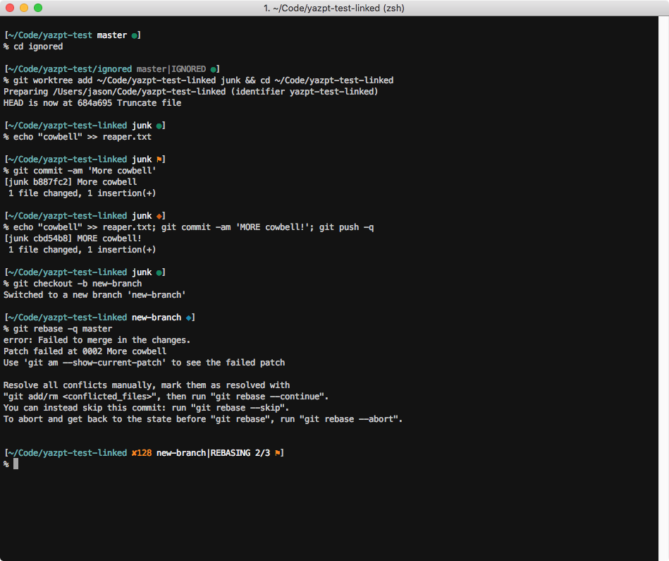
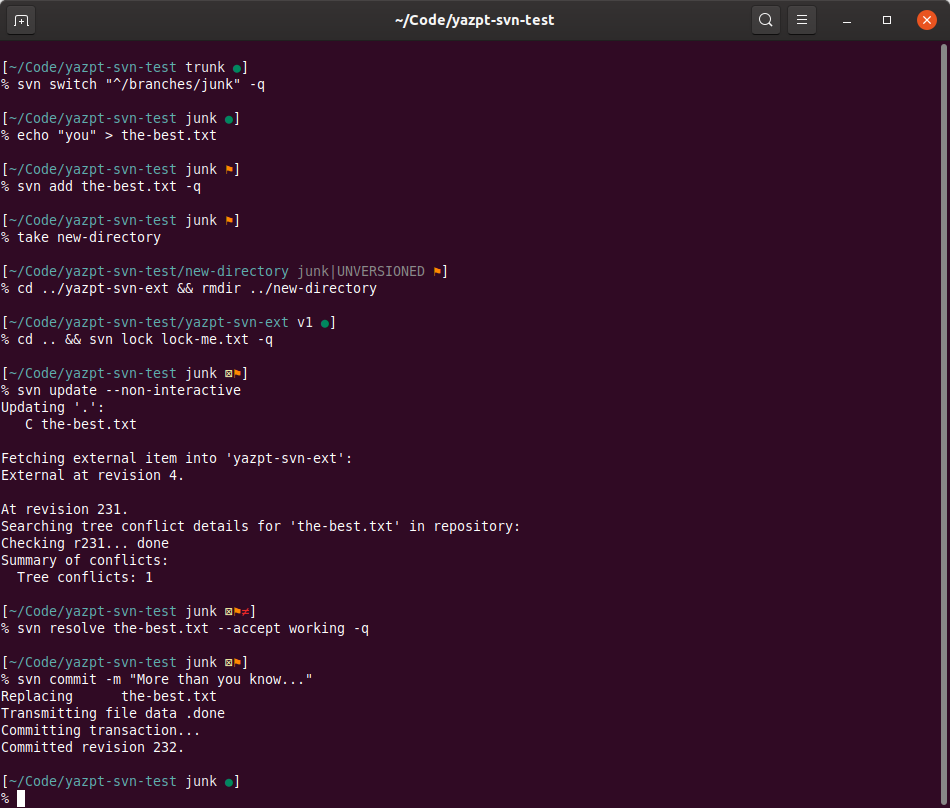
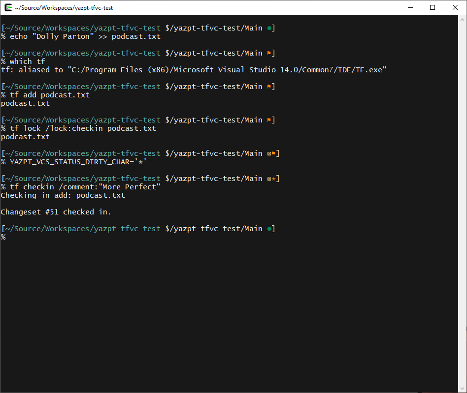
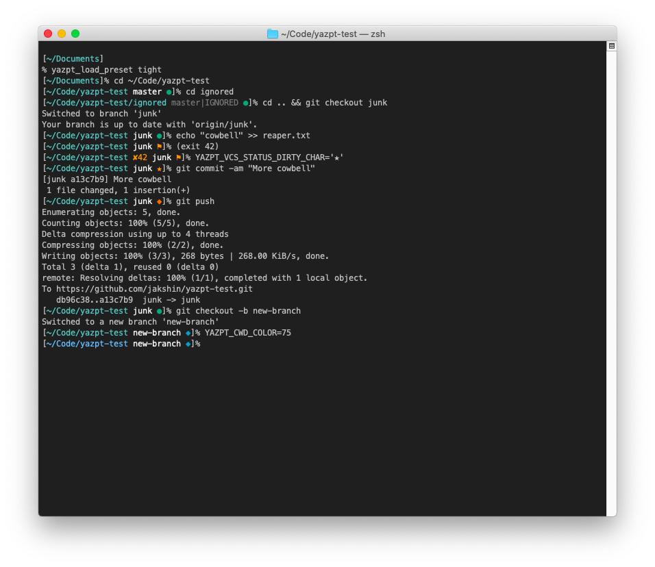
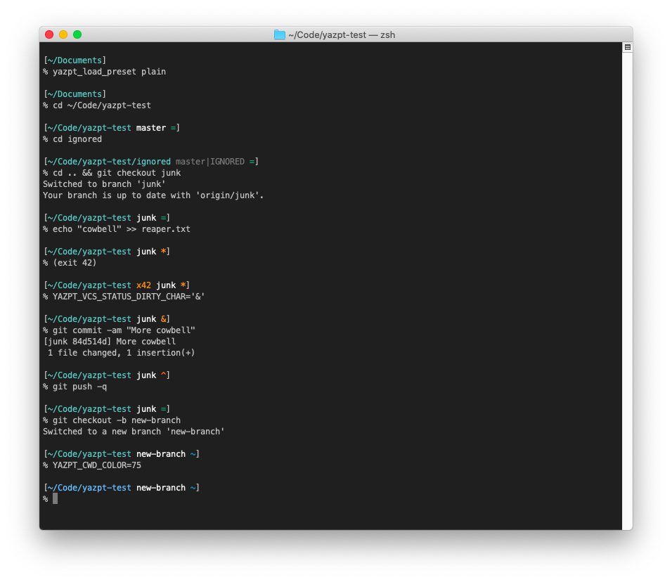
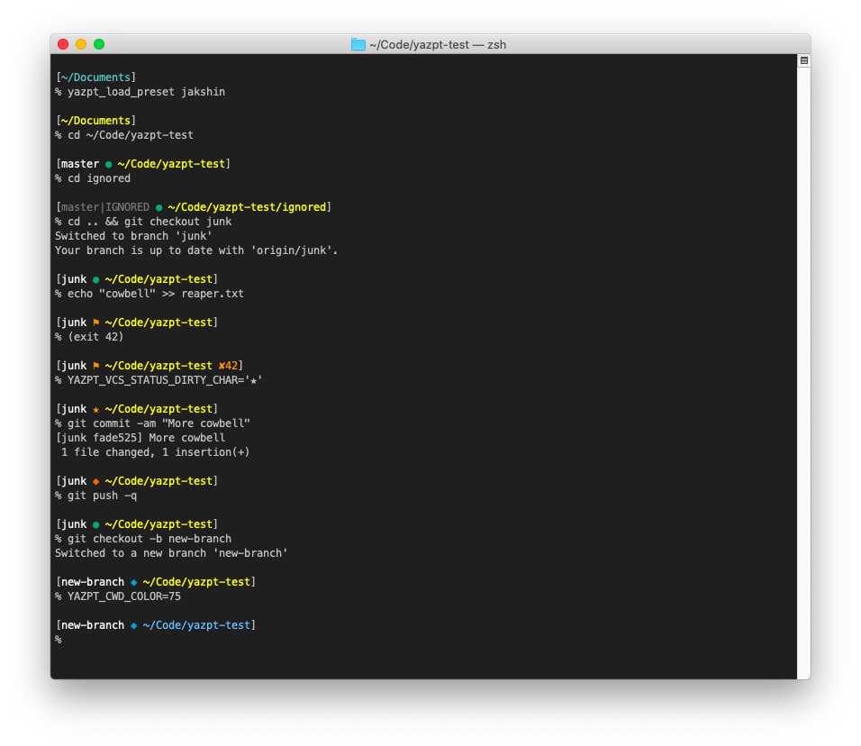
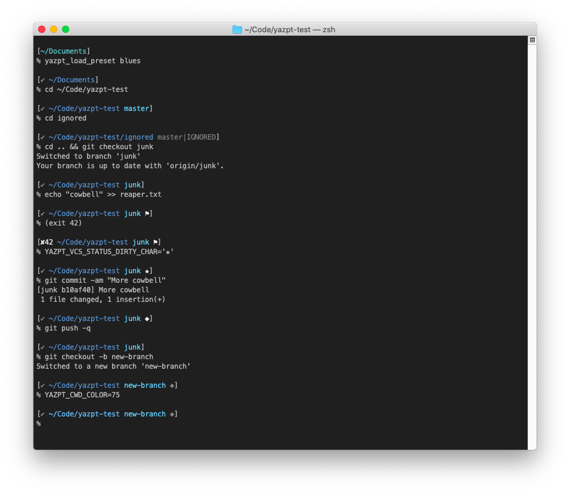
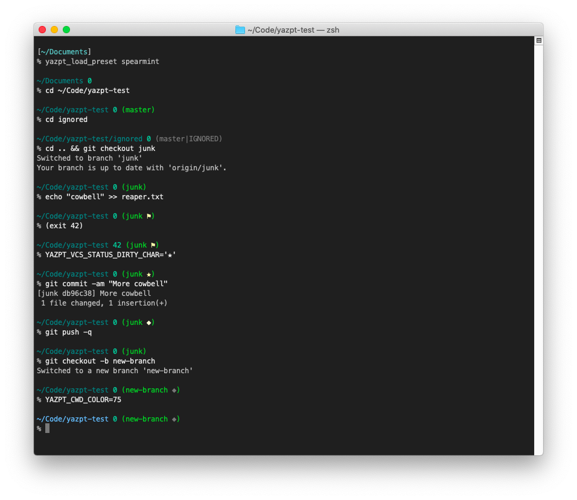
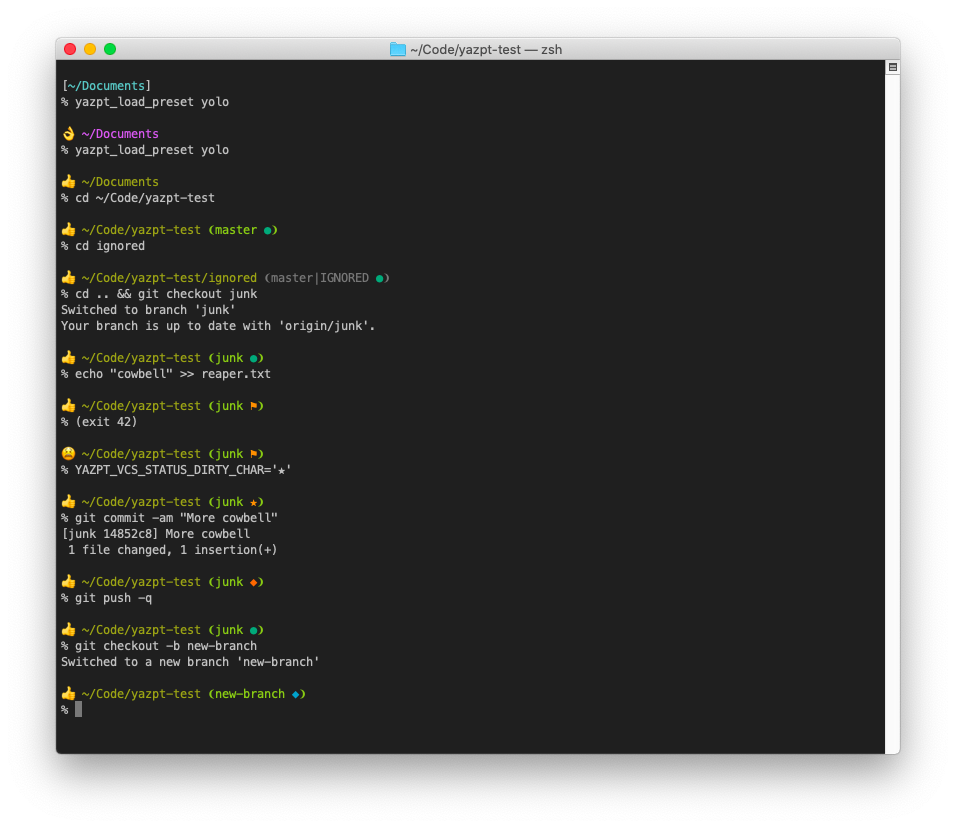

# yazpt = yet another zsh prompt theme

Yazpt is a clean, fast, good-looking [zsh](http://zsh.sourceforge.net) prompt theme that thoughtfully incorporates Git/Subversion/TFVC status info, integrates with popular plugin managers like [Oh My Zsh](#with-oh-my-zsh), and is straightforward to customize and extend.

<p align="center">[
  <a href="#features">Features</a>
• <a href="#supportedtested-environments">Supported/Tested Environments</a>
• <a href="#installing">Installing</a>
• <a href="#enabling-subversion-andor-team-foundation-version-control">Enabling Subversion/TFVC</a>
• <a href="#customizing">Customizing</a>
]</p><br>


Git | Subversion | TFVC
----| ---------- | ----
 |  | 

Yazpt's appearance can be easily changed by loading one of its presets:

dense preset | elementary preset | jakshin preset
-------------| ----------------- | --------------
 |  | 

sapphire preset | spearmint preset | yolo preset
----------------| ---------------- | -----------
 |  | 


## Features

* **It's pretty fast, without async.**
  It's faster than any prompt theme which relies on [vcs_info](https://github.com/zsh-users/zsh/tree/master/Functions/VCS_Info), and faster than nearly all prompt themes which don't use async approaches for obtaining and displaying VCS status. Prompt themes which populate the VCS parts of the prompt asynchronously can be faster, but I actually tend not to love them, as I personally find it a bit distracting when part of the prompt pops into existence a bit later than the rest.

  Yazpt also allows you to configure lists of path prefixes in which you expect to find Git repos, Subversion working copies, and/or Team Foundation Version Control local workspaces - if you've done so, then while working in any path which isn't in one or more of those lists, it skips checking for Git/Subversion/TFVC status, improving performance even further. If you don't happen to use one or more of the supported VCSs, you can also entirely disable yazpt's use of any of them.

* **It's as configurable as you want it to be.**
  Yazpt uses about three dozen environment variables to tweak its appearance and behavior. If that sounds like too much to bother with, it also comes with a handful of "presets", i.e. preconfigured settings for the environment variables, in a variety of styles. Or if, on the other hand, you really want to dig in and customize it, it's straightforward to add new prompt segments, or override the default implementations of existing prompt segments, using zsh functions. Either way, the details are [documented](customizing.md).

* **It lets you do your own thing with $PS1 and $RPS1.**
  Yazpt thinks of itself as an add-on or power-up, not a replacement, for zsh's built-in prompt logic, so if you've already spent time pimping out your `$PS1` or `$RPS1`, there's no need to throw that work away - you can copy your current `$PS1` straight into `$YAZPT_LAYOUT` (and/or `$RPS1` into `$YAZPT_RLAYOUT`), and then add any yazpt-specific segments you'd like.

* **It's secure.**
  A surprising number of prompt themes will execute arbitrary shell code if you [browse an unsafe repo](https://github.com/jakshin/pw3nage). Others fail to escape the info they show in ways that lead to corrupted display, e.g. allowing zsh to interpret percent escape sequences or exclamation marks in either the current directory's path or a VCS branch name. Yazpt tries hard to avoid those mistakes, and works properly regardless of your preferences about zsh settings like `prompt_subst` and `prompt_bang`.

* **It doesn't require a patched font.**
  Because it uses only standard Unicode characters, yazpt works fine with most standard terminal fonts. You don't need a patched one, like from [Nerd Fonts](https://www.nerdfonts.com) or [Powerline Fonts](https://github.com/powerline/fonts) - but of course if you use one of those fonts in your terminal, you can configure yazpt to use its special glyphs.

* **It incorporates Git info thoughtfully.**
  Rather than try to display every detail about the Git status in the prompt, like many prompt themes do, and which has always seemed a bit visually busy to me, yazpt tries to boil it all down to a few key bits of info: the current branch, whether a significant activity is in progress (like merging or rebasing), and one of 3 meaningful, action-oriented statuses:
  * The working tree is dirty (with untracked files, and/or staged or unstaged changes),
  * The local branch has different commits than its remote branch, or
  * Both the working tree and branch are clean, i.e. neither of the above is true.

  There are a couple of other statuses that can be shown in less-common situations; in any case, if you don't know or remember what one of the status characters means, you can just run the explainer function, `yazpt_explain_git`, for full details.

  Yazpt goes out of its way to make its Git support seamless, e.g. by showing correct Git status info even when you're browsing in the `.git` directory, which most other prompts don't bother to do.

  Incidentally, yazpt supports bare repos, linked worktrees, and even bare repos' linked worktrees, more completely and correctly than any other prompt theme I've tried.

* **It incorporates Subversion info thoughtfully, too.**
  There are a few cases where I still need to use Subversion, and I've generally found other prompt themes' support for it a bit lacking. The biggest gap is that although Subversion thinks of status as a per-directory concept, in all of my SVN usage patterns, it would be more convenient and helpful to see status across my whole working copy, like I'm used to while using Git.

  In general, what I want to know while using Subversion in a terminal is:
  * Which branch I have checked out (usually `trunk`, but occasionally something else),
  * Whether my last `svn update` resulted in a conflict that I haven't resolved yet,
  * Whether I have any files locked, anywhere in my working copy, and
  * Whether my working copy is dirty anywhere, i.e. has new unversioned files/directories,
    or uncommitted file/directory/property changes, in any directory.

  So that's exactly what yazpt shows - even, unlike many other prompt themes, while the current directory is ignored or unversioned, including in the `.svn` directory.

  Yazpt also has an explainer function for its Subversion statuses - just run `yazpt_explain_svn` for a list of all possible Subversion statuses and their meanings.

  Note that yazpt's Subversion support is disabled by default, and needs to be [enabled](#enabling-subversion-andor-team-foundation-version-control).

* **It incorporates Team Foundation Version Control info.**
  While I'd probably be a bit happier if TFVC went the way of VSS, the world doesn't always work exactly how I'd like. 😉

  When I use TFVC, it's usually in Visual Studio - and I think I'm normal in that regard - so only lightweight support for TFVC at a prompt seems warranted:
  * Some basic context, i.e. the workspace's server path,
  * Whether the workspace is dirty at all, i.e. has any pending additions/modifications/deletions, and
  * Whether I have any items locked.

  Command-line tools for TFVC exist - a `TF.exe` ships with Visual Studio for Windows, and on other platforms there's a CLI tool called [TEE-CLC](https://github.com/microsoft/team-explorer-everywhere) - but they run far too slowly to be used while generating a prompt, so instead yazpt parses a couple of TFVC's binary data files itself (`properties.tf1` and `pendingchanges.tf1`).

  The `yazpt_explain_tfvc` explainer function shows the details.

  Note that yazpt's TFVC support is disabled by default, and needs to be [enabled](#enabling-subversion-andor-team-foundation-version-control).
  <p align="center">•</p>


## Supported/Tested Environments

Yazpt's code logic should work just about anywhere zsh 5.1+ itself does, and with any semi-recent version of the Git and Subversion CLIs, but how well its Unicode VCS status characters get rendered can vary a bit across environments; a bit of tinkering usually fixes things up nicely, or you can load the [elementary preset](./presets/elementary-preset.zsh), which only uses ASCII characters.

### macOS

My primary environment is macOS, and yazpt works without fuss on recent versions, in Terminal.app and [iTerm](https://iterm2.com) v3.3+, with the system zsh, and either the system or [Homebrew](https://brew.sh) versions of git and svn. I use yazpt on these macOS versions regularly:

* **macOS 10.15 Catalina**,
  using Andale Mono, Courier, Menlo, Monaco, [Bitstream Vera Sans Mono](https://www.gnome.org/fonts), [Fira Code](https://github.com/tonsky/FiraCode), [Meslo](https://www.nerdfonts.com), and [Source Code Pro](https://github.com/adobe-fonts/source-code-pro) fonts (all with Terminal.app's "Antialias text" setting turned on)
* **macOS 10.14.6 Mojave**
* **macOS 10.13.6 High Sierra**

### Windows

I don't always run zsh on Windows, but when I do, I prefer to use [Cygwin](https://cygwin.com). Here's a list of the Windows versions on which I've used yazpt with Cygwin, in Mintty 3.x (Cygwin's default terminal):

* **Windows 10 Pro (version 1909)**
* **Windows 8.1 Pro**
* **Windows 7**,
  with the [DejaVu Sans Mono font installed](./tips-for-windows.md#older-windows-versions) so yazpt's Unicode characters will render right

I've also tested yazpt on Windows 10 in various other scenarios, like with MSYS2 and Windows Subsystem for Linux (WSL), and in alternate terminals like ConEmu, Terminus, MobaXterm, etc. In almost all cases, a bit of tweaking is needed for best results - see the [tips for using yazpt on Windows](./tips-for-windows.md) for details.

### Linux

In many recent GNU/Linux versions, especially those targeted at general desktop/laptop use, yazpt is rendered pretty well out of the box, but usually some minimal adjustments are needed for best effect; for instance, _in GNOME Terminal, you always need to check the "Custom font" checkbox to get decent rendering of yazpt's Unicode characters_. It's also common for changing the terminal font to improve rendering of yazpt's Unicode characters, and not unusual to need to install a font or two, especially to get the yolo preset's emoji looking good. See the [tips for using yazpt on GNU/Linux](./tips-for-linux.md) for details.

I've used or tested yazpt in the following distros, using both their standard terminal emulator (usually GNOME Terminal, but sometimes Konsole, MATE Terminal, or Xfce Terminal), with default settings; and XTerm, with my [.Xresources file](./resources/Xresources) loaded:

* **Bodhi Linux 5.1**, running Enlightenment;
    [Install a font](./tips-for-linux.md#bodhi-linux-51-enlightenment) to upgrade from emoticons to color emoji
* **CentOS 8.1**, installed as a "server with GUI";
    [Install a font](./tips-for-linux.md#centos-81-installed-as-a-server-with-gui) for better rendering
* **Debian 10.3**
* **elementary OS 5.1 (Hera)**
* **Fedora Workstation 32**
* **Kali Linux 2020.2**;
    [Install a font](./tips-for-linux.md#kali-linux-20202) to upgrade from emoticons to color emoji
* **Kubuntu 20.04**
* **Linux Mint Cinnamon 19.3 (Tricia)**
* **Linux Mint Cinnamon 18.3 (Sylvia)**;
    No color emoji, but monochrome emoji if you [install a font](./tips-for-linux.md#linux-mint-cinnamon-183-sylvia)
* **Manjaro 20.0 (Lysia)**, running XFCE;
    [Install a font or two](./tips-for-linux.md#manjaro-200-lysia-running-xfce) for better emoji rendering
* **MX Linux 19.1 (patito feo)**;
    [Install a font](./tips-for-linux.md#mx-linux-191-patito-feo) to upgrade from monochrome to color emoji
* **openSUSE Tumbleweed**, running KDE Plasma 5
* **Pop!_OS 20.04**
* **Solus 4.1 (Fortitude)**, running Budgie
* **Ubuntu 20.04 (Focal)**
* **Ubuntu 19.10 (Eoan)**
* **Ubuntu 18.04 (Bionic)**
* **Ubuntu 16.04 (Xenial)**;
    No color emoji, but monochrome emoji if you [install a font and tweak fonts.conf](./tips-for-linux.md#ubuntu-1604-xenial-xerus)
* **Ubuntu MATE 20.04**
* **Ubuntu MATE 19.10**

### BSD

I don't use BSDs much, but just for kicks I tried yazpt out on a couple.

* **FuryBSD 12.1**, running XFCE   
    Yazpt works rather poorly out of the box in Xfce Terminal; to fix it, add this to your `~/.zshenv` (or your shell's rough equivalent, if zsh isn't your login shell):   
    `export LANG=en_US.UTF-8 LC_ALL=en_US.UTF-8 LC_CTYPE=en_US.UTF-8`
* **GhostBSD 20.04.1**   
    For better rendering of yazpt's Unicode characters in MATE Terminal, uncheck its "Use the system fixed width font" checkbox in your profile preferences

In both of those BSDs, which are based on FreeBSD, MATE Terminal and Xfce Terminal mis-render emoji regardless of whether the Noto fonts are installed (`noto-basic-2.0` package), so the yolo preset tries to detect when it's running on FreeBSD or a derivative, and switches to emoticons instead.
<p align="center">•</p>


## Installing

Yazpt can be installed in a variety of ways, with popular zsh frameworks or completely on its own.

### Without a framework

Yazpt doesn't require a framework - to start using it, you can just `source yazpt.zsh-theme`, on demand or in your `.zshrc` file. To install, clone the git repo to a location of your choice:

```sh
git clone https://github.com/jakshin/yazpt ~/.yazpt
```

Then source the theme file (in your `.zshrc` to apply it in all terminal sessions), and optionally load a preset and/or tweak some settings:

```sh
source ~/.yazpt/yazpt.zsh-theme

# Optionally, and for example
yazpt_load_preset dense  # Run yazpt_list_presets to see available choices
YAZPT_CWD_COLOR=70       # Type 'YAZPT_' and press tab to see all settings
```

### With zsh's prompt theme system

Yazpt integrates with zsh's native "promptinit" [prompt theme system](http://zsh.sourceforge.net/Doc/Release/User-Contributions.html#Prompt-Themes). To install, clone the git repo to a location of your choice, and symlink `prompt_yazpt_setup` into a directory in your `$fpath`; running `install-resources.zsh` is the easiest way:

```sh
git clone https://github.com/jakshin/yazpt ~/.yazpt  # Or wherever you'd like
~/.yazpt/resources/install-resources.zsh
```

To begin using yazpt:

```sh
autoload -U promptinit && promptinit  # Usually in .zshrc
prompt yazpt  # You can pass a preset's name if you want, e.g. `prompt yazpt spearmint`
```

### With Oh My Zsh

To install, clone the git repo, and create a symlink for [Oh My Zsh](https://ohmyz.sh) to find:

```sh
git clone https://github.com/jakshin/yazpt $ZSH_CUSTOM/themes/yazpt
ln -sv $ZSH_CUSTOM/themes/yazpt/yazpt.zsh-theme $ZSH_CUSTOM/themes/yazpt.zsh-theme
```

Then, in your `.zshrc`, _before_ the `source $ZSH/oh-my-zsh.sh` line:

```sh
ZSH_THEME="yazpt"
```

If you'd like to load a preset and/or tweak some settings, put those lines in your `.zshrc` in the "User configuration" section (_after_ the `source $ZSH/oh-my-zsh.sh` line):

```sh
# Optionally, and for example
yazpt_load_preset jakshin
YAZPT_CWD_COLOR=14
```

### With Prezto

If you've already installed yazpt for zsh's [prompt theme system](#with-zshs-prompt-theme-system), it'll Just Work with [Prezto](https://github.com/sorin-ionescu/prezto) as well. You don't even need to enable Prezto's Git module.

Otherwise, to install yazpt into Prezto, clone the git repo to a location of your choice, and symlink `prompt_yazpt_setup` into your `.zprezto/modules/prompt/functions` directory:

```sh
git clone https://github.com/jakshin/yazpt ~/.yazpt  # Or wherever you'd like

target_path="${ZDOTDIR:-$HOME}/.zprezto/modules/prompt/functions"
ln -sv ~/.yazpt/functions/prompt_yazpt_setup $target_path/prompt_yazpt_setup
```

To use yazpt on demand, run `prompt yazpt`, optionally with a preset, e.g. `prompt yazpt sapphire`. To make it your default prompt, put this in the "Prompt" section of your `~/.zpreztorc`:

```sh
zstyle ':prezto:module:prompt' theme 'yazpt'
# Or with a preset: zstyle ':prezto:module:prompt' theme 'yazpt' 'sapphire'
```

To tweak yazpt's settings further, add to the bottom of your `.zshrc`, below the "Customize to your needs" line:

```sh
# Optionally, and for example
yazpt_load_preset sapphire
YAZPT_GIT_HIDE_IN_BARE_REPO=true
```

If you explicitly configure Prezto's [pwd-length](https://github.com/sorin-ionescu/prezto/tree/master/modules/prompt#prompt-display-length) or [show-return-val](https://github.com/sorin-ionescu/prezto/tree/master/modules/prompt#display-return-value) settings, yazpt will respect those settings while running under Prezto - but you _do_ need to configure them explicitly, rather than relying on Prezto's defaults for those settings, as yazpt doesn't know or care about Prezto's defaults. You'll also still need an `<exit>` somewhere in your $YAZPT_LAYOUT or $YAZPT_RLAYOUT for setting `show-return-val` to `yes` to work.

```sh
# Optionally, and for example
zstyle ':prezto:module:prompt' pwd-length 'short'
zstyle ':prezto:module:prompt' show-return-val 'no'
```

### With Zinit

To try the prompt out under [Zinit](https://github.com/zdharma/zinit) (formerly named Zplugin), run `zinit load jakshin/yazpt`. To use the prompt in all terminal sessions, just add that line to your `.zshrc`, then tweak any settings you'd like:

```sh
zinit load jakshin/yazpt
yazpt_load_preset yolo  # Optionally, and for example
```

Yazpt implements an unload function as specified in the [Zdharma Zsh Plugin Standard](https://github.com/zdharma/Zsh-100-Commits-Club/blob/master/Zsh-Plugin-Standard.adoc#unload-fun), so you can unload it by calling `zinit unload jakshin/yazpt`.
<p align="center">•</p>


## Enabling Subversion and/or Team Foundation Version Control

By default, yazpt disables its support for Subversion and Team Foundation Version Control. To enable either or both of those VCSs in the prompt, you'll need to adjust the `$YAZPT_VCS_ORDER` - a good place to do this is right after you load yazpt in your `.zshrc`. For example, if you mostly use Git, but occasionally work in Subversion and TFVC repos, you can use this setting:

```sh
YAZPT_VCS_ORDER=(git svn tfvc)
```

In order to prevent performance from dropping with the additional VCSs enabled, you'll probably also want to configure yazpt's path prefix list for each VCS, so it only spends time trying to gather VCS status when it needs to. For example, on Windows with Cygwin, something like this might work well:

```sh
user_profile_path="$(cygpath "$USERPROFILE")"
YAZPT_GIT_PATHS=("$user_profile_path/Documents/Visual Studio 2019/Projects/" ~/.yazpt)
YAZPT_SVN_PATHS=("$user_profile_path/Documents/Code/")
YAZPT_TFVC_PATHS=("$user_profile_path/Source/Workspaces/")
```

Note that while yazpt knows when the current directory is ignored by Git or Subversion, and uses a different color when displaying the VCS context, it doesn't know this for TFVC -- if you cd into an ignored directory in a TFVC loca workspace, the VCS status will still be displayed in the default color. Yazpt does know enough about whether files/directories are ignored by TFVC to correctly display the local workspace's clean/dirty state, though.

Also, when using TFVC on Windows, with the workspace open in Visual Studio, any changes in the workspace get noticed immediately, whether they're made through Visual Studio or otherwise, and TFVC updates its metadata in the `$tf` directory right away. The same is true when making changes via the `tf` CLI, whether VS is running or not. But otherwise, like while changing files using general command-line utilities without Visual Studio running, TFVC won't notice changes until you kick it a little - by, say, running `tf info` or `tf status`. I hope to improve on this situation eventually.
<p align="center">•</p>


## Customizing

Yazpt is quite customizable, with options ranging from very simple (loading a preset) to somewhat complex (implementing a custom segment). [Read on for details](customizing.md).
